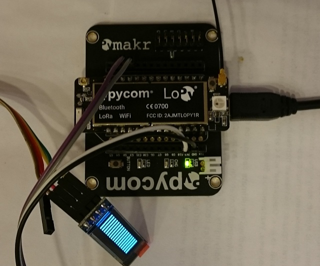
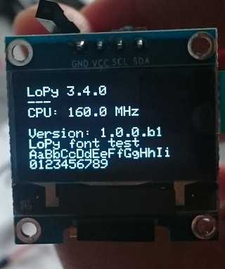
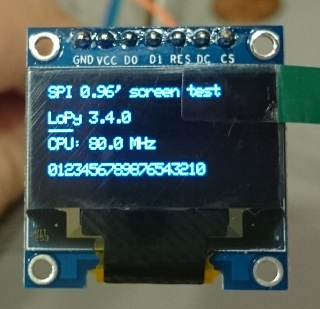

# LoPyI2CLCD
LoPy I2C/SPI LCD Library

**I2C Display:**





**SPI Display:**



# Display wiring
**i2c:** 
GND, 3.3V, SDA, SCL (see LoPy pinout)

**spi:** 
D0 - P10 (CLK)
D1 - P11 (MOSI)
DC - P23
RST - P22
CS - not used (for some displays needs to be connected with GND)

# Example:
```python
displayType = kDisplaySPI128x64
initialize(displayType)
if isConnected():
   set_contrast(128) # 1-255
   displayOn()
   clearBuffer()
   addString(0, 0,  sys.platform + " " + sys.version)
   addString(0, 1,  "---")
   addString(0, 2,  "CPU: {} MHz".format(machine.freq()/1000000))
   drawBuffer()
```
